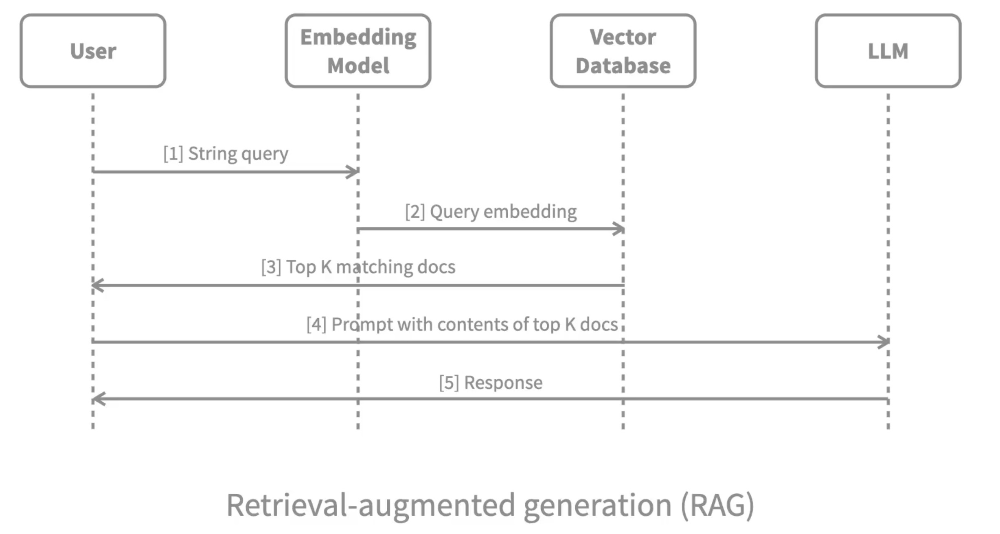
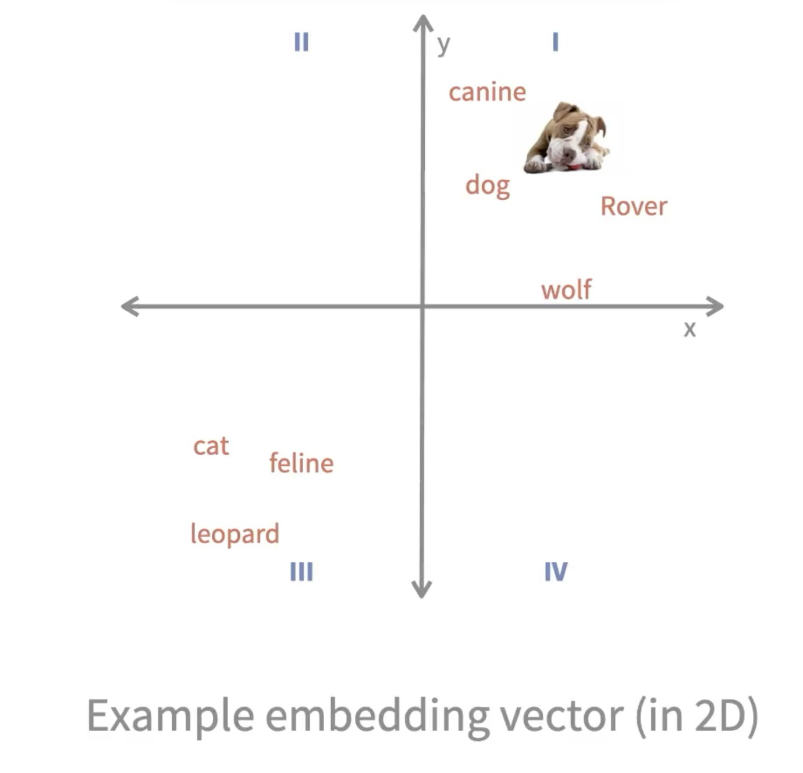
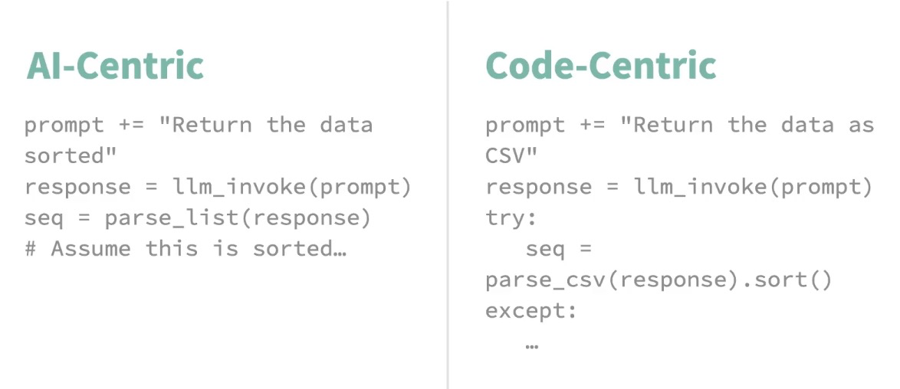
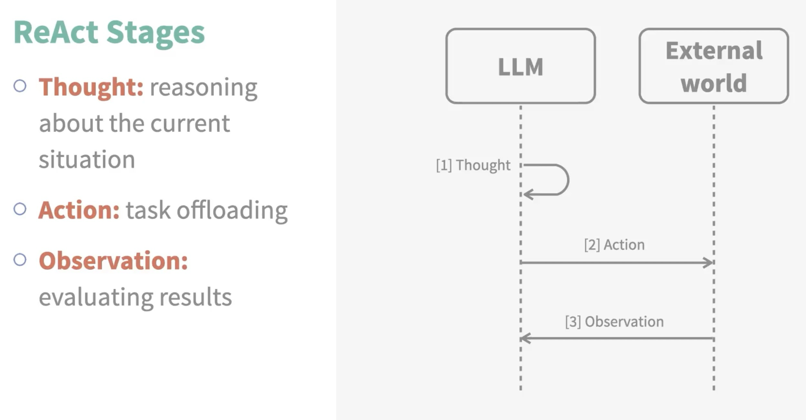

Have fun fixing dependencies:

- try a venv in python3.11 and then downgrade libs as required
- or use latest libs and the fix the imports (seems better approach) ⭐️

Scripts would look better as Jupyter Notebooks 🚧

## Some Notes

### AI Orchestration Frameworks

A software tool to:
- help coordinate the overall operation of AI applications
- hide the when the specific details and boiler plate code needed to talk to the APIs

### Retrieval-augmented generation (RAG)

### AI-Centric vs Code-Centric Prompts
e.g.

| Approach            | Pros                                                                 | Cons                                                                 |
|----------------------|----------------------------------------------------------------------|----------------------------------------------------------------------|
| **AI-centric** (LLM handles sorting) | ✅ Simple pipeline — minimal code needed. ✅ Quick to prototype. ✅ Good for fuzzy or subjective sorting (“by importance”, “by tone”). | ❌ Unreliable — LLM may mis-sort or ignore instructions. ❌ Hard to verify errors automatically. ❌ Limited recovery options (requires re-prompting or manual fix). |
| **Code-centric** (sort in Python) | ✅ Deterministic and testable results. ✅ Clear error handling and logging possible. ✅ Keeps logic separate — LLM generates data, code processes it. | ❌ Requires parsing/validation (e.g., JSON). ❌ More plumbing and error-handling code. ❌ Slightly higher latency or complexity. |

**Rule of Thumb**
For anything for which you would have written code, even before you heard of LLM's, choose a code-centric approach.

### LLM function calling

**Warning** 
- Limit access, supervise everything

### ReAct Agent Framework
